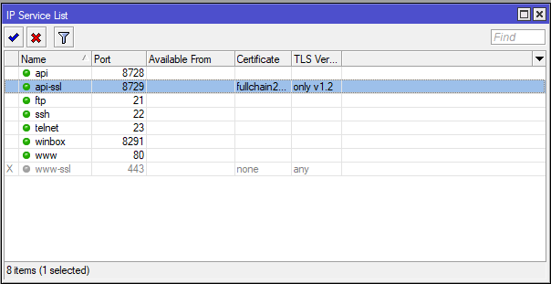

# api-ssl

Mikrotik allowes to connect through ssl to the api.
You should connect through the port usually 8729
that can be configures together with the corresponding
ssl certificate here:

If you have a certificate that is not in the registered
CA list of machine there node-red is running on you can
disable the checking of the SSL certificate via the
settings on the mikrotik device settings.
